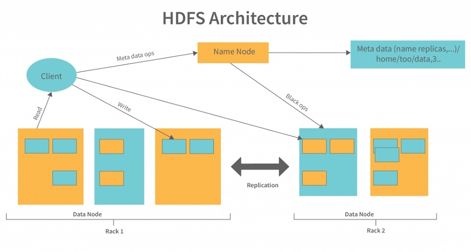

## Introduce HDFS

- HDFS - Hadoop Distributed File System
- Nền tảng lưu trữ phân tán => xử lí dữ liệu lớn => khi data user lớn storage trên 1 máy không khả thi
- HDFS -> chia dữ liệu nhỏ -> phân tán trên nodes (node mạng)
- Mỗi phần dữ liệu nhỏ -> sao chép trên các nút -> đảm bảo tính sẵn sàng, bền vững
- Khi 1 node crash -> HDFS sử dụng bản sao 1 node -> tiếp tục xử lí
- có khả năng scale up và scale out (nâng cấp cấu hình/ thêm các node)
- xử lí dạng khối batch processing
- dữ liệu được ghi và đóng lại không thể modify => nhất quán

## HDFS Architecture

**1. Mô hình master/slave**

**2. Một cluster HDFS bao gồm một NameNode và nhiều DataNode**

## How HDFS work ?

**I. File thường được lưu kích thước cố định 128MB/256MB**

**II. Default mỗi khối data => replica 3 lần => lưu trên DataNode khác nhau**

**III. Client connect to NameNode => tạo file + list DataNode => success NameNode return notification**

**IV. Client connect to NameNode => lấy metadata + vị trí các khối => đọc trực tiếp từ nhiều DataNode song song => các khối data được ghép lại => data hoàn chỉnh**
